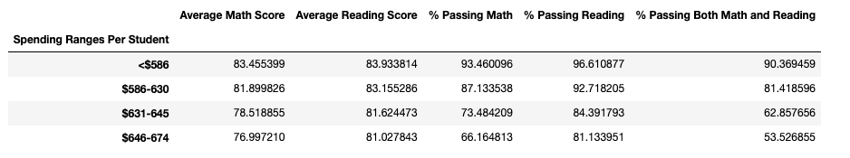

# School District Analysis

### Overview:

The purpose of this analysis is to examine the success of various schools within a specific school district. A client has requested an analysis of standardized testing grades by specific school, by grade, by school budget, and by school size. The client suspects there are inaccuracies in the test scores for the 9th grade class at Thomas High School and has requested these datapoints be removed from calculations. The following results and summary demonstrate the impact of the removal of the 9th grade class at Thomas High School from the analysis.

### Resources
- Data Sources: [schools_complete.csv](schools_complete.csv) & [students_complete.csv](students_complete.csv)
- Software: Python 3.9.12, Visual Source Code 1.68.1
	    Jupyter Notebooks

### Results:

#### District Summary

- Average Math Score changed from 79 to 78.9
- The percentage of students passing math in the district changed from 75 to 74.8
- The percentage of students passing reading in the disctrict changed from 85.8 to 85.7
- The percentage of students passing both math and reading in the district changed from 65.2 to 64.9

**District Summary Before**

**District Summary After**

#### School Summary

- The average math score for Thomas High School changed from 83.42 to 83.35
- The average reading score for Thomas High School changed from 83.85 to 83.90
- The percentage of students passing math from Thomas High School changed from 93.27 to 93.18
- The percentage of students passing reading from Thomas High School changed from 97.31 to 97.02
- The percentage of students passing both math and reading from Thomas High School changed from 90.95 to 90.63
	
**School Summary Before**

**School Summary After**

	
#### Overall Performance Compared to other Schools

- Thomas High School is ranked as the second best school in the district in terms of their percentage of students who passed both math and reading, regardless of whether the 9th grade class scores are considered.

#### Scores by Grade
- After removing the inaccurate 9th grade scores for Thomas High School, the data frames reflecting the standardized test scores by grade no longer have results for the 9th graders at Thomas High School

#### Scores by School Spending

- Another minor change: 
	- The category for school spending per student associated with Thomas High School is $631-645
	- The overall success for this category changes from 62.86% of students passing both math and reading to 62.79%

**Scores by School Spending Before**

**Scores by School Spending After**

#### Scores by School Size
- No impact
#### Scores by School Type
- No impact

### Summary:

The removal of the inaccurate grades for the 9th grade class at Thomas High School appears to have created very minor impacts on the overall analysis. The following are examples of this impact:

1.	The already noticeable trend in school performance vs. school spending became even more obvious. When the 9th graders from Thomas High School were removed from the dataset, the overall success of schools that spent $631-645 per student was lowered, highlighting the trend that seems to indicate that schools who spend less per student actually have higher percentages of students who pass both math and reading exams.
2.	Removing the 9th graders from Thomas High School resulted in lower percentages of students passing in math, reading and overall across the district
3.	The removal of the students in 9th grade at Thomas High School had a small negative impact on the general success of Thomas High School in math scores and the percentages of students passing in math, reading and overall.
4.	The reading average score at Thomas High School actually improved with the removal of the 9th grade class.
